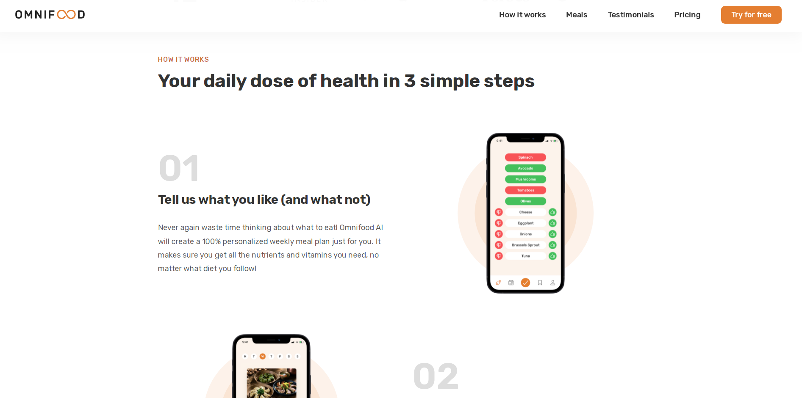
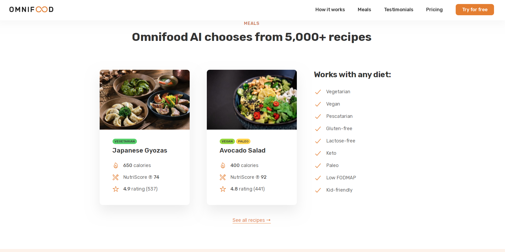
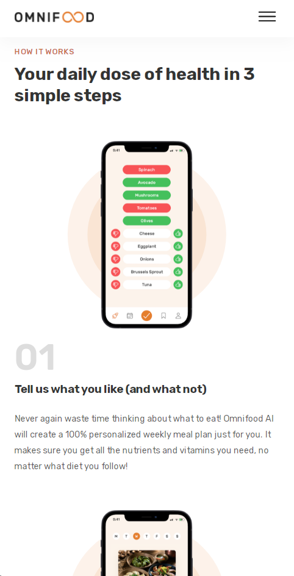
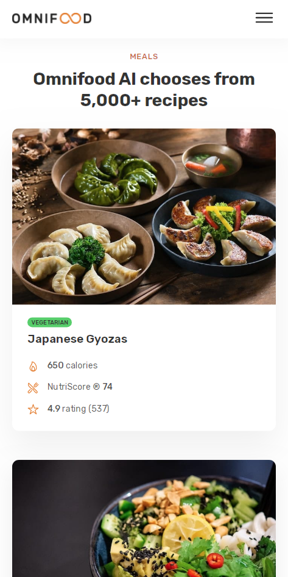

# Omnifood

## Description

Landing page for the fictional application Omnifood.

This is the final project of the course:
"Build Responsive Real-World Websites with HTML and CSS" with Jonas Schmedtmann

## Built with

- HTML5
- CSS3
- JavaScript

## Screenshots

- Desktop

- Mobile

## Links

[live Site URL](https://sanramu93.github.io/Omnifood/)

## Author

[@sanramu93](https://github.com/sanramu93)

## Version History

- 0.1
  - Initial Release
